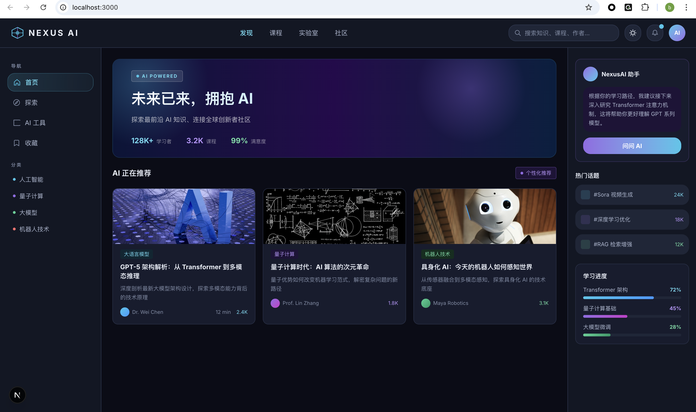
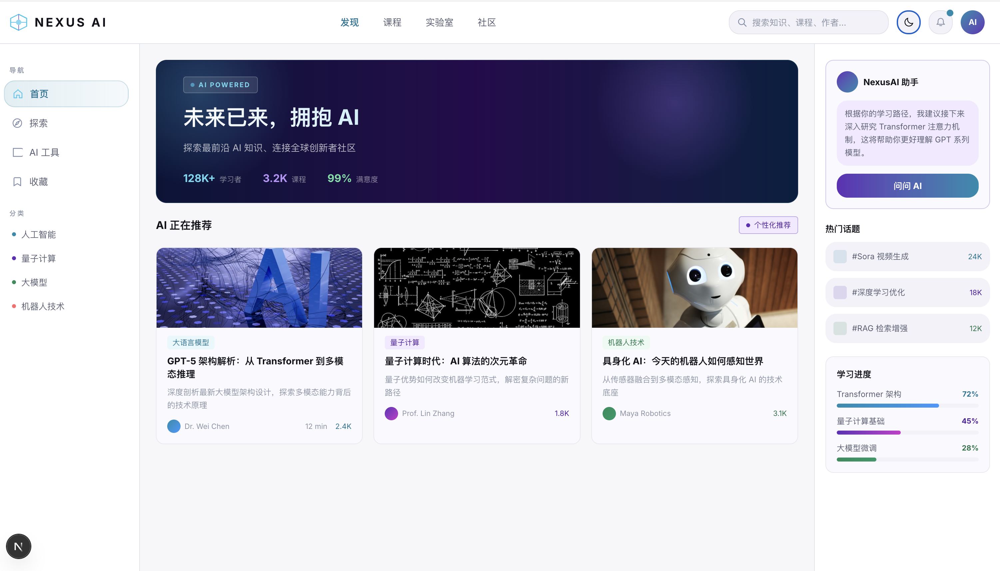

# NexusAI — AI 知识分享平台

一个由 **ardot MCP** 驱动的 Design-to-Code 全链路实践项目。从 AI 生成设计稿到前端代码一键打通，支持 Dark / Light 双主题。




## ✨ 特性

- **AI 生成设计稿** — 通过 ardot MCP 直接在画布上生成完整 UI，无需手动绘制
- **Design Token 驱动** — 24 个设计变量（17 色彩 + 6 数值 + 1 圆角），设计与代码零偏差
- **Dark / Light 双主题** — 一套 Token 系统，CSS 变量一键切换
- **组件化架构** — 6 个可复用组件，设计稿与 React 组件 1:1 对应
- **Tailwind v4** — Design Token 直接映射为 `@theme` 变量，无需手动同步

## 🛠 技术栈

| 技术 | 版本 | 说明 |
|------|------|------|
| [Next.js](https://nextjs.org/) | 15 | React 全栈框架（Turbopack） |
| [React](https://react.dev/) | 19 | UI 组件库 |
| [Tailwind CSS](https://tailwindcss.com/) | 4 | 原子化 CSS 框架 |
| [TypeScript](https://www.typescriptlang.org/) | 5.7 | 类型安全 |

## 📁 项目结构

```
NexusAI/
├── app/
│   ├── globals.css          # 24 Design Tokens (Dark + Light)
│   ├── layout.tsx           # Root layout
│   └── page.tsx             # 主页面
├── components/
│   ├── TopNav.tsx           # 顶部导航栏
│   ├── Sidebar.tsx          # 左侧边栏
│   ├── HeroBanner.tsx       # Hero 区域（渐变 + 光效）
│   ├── KnowledgeCard.tsx    # 知识卡片
│   ├── RightPanel.tsx       # 右侧面板（AI 助手 / 趋势 / 进度）
│   └── ThemeToggle.tsx      # Dark / Light 主题切换
├── package.json
└── tsconfig.json
```

## 🚀 快速开始

### 前置条件

- Node.js 18+
- npm 或 yarn

### 安装与运行

```bash
# 克隆仓库
git clone https://github.com/libairu/NexusAI.git
cd NexusAI

# 安装依赖
npm install

# 启动开发服务器
npm run dev
```

打开 [http://localhost:3000](http://localhost:3000) 即可查看。

### 构建生产版本

```bash
npm run build
npm start
```

## 🎨 Design Token 体系

项目使用变量驱动的双主题设计系统，所有颜色通过 CSS 变量控制：

| Token | Dark | Light | 用途 |
|-------|------|-------|------|
| `$bg-base` | `#0A0D17` | `#F7F7FA` | 页面底色 |
| `$bg-surface` | `#121724` | `#FFFFFF` | 面板背景 |
| `$bg-card` | `#171C2E` | `#FAFAFE` | 卡片背景 |
| `$accent-cyan` | `#33C7EB` | `#0D8CAE` | 主强调色 |
| `$accent-purple` | `#946BE6` | `#612EB8` | 次强调色 |
| `$accent-green` | `#40D194` | `#148C5A` | 成功色 |
| `$text-primary` | `#EBF0FA` | `#12121A` | 主文本 |
| `$text-secondary` | `#ADB8D1` | `#5A5E73` | 次文本 |

> 完整 24 个 Token 定义见 [`app/globals.css`](app/globals.css)

## 🎬 设计稿生成过程

CodeBuddy 通过 Ardot MCP 在画布上实时生成设计稿的完整过程录屏：

https://github.com/user-attachments/assets/ardot-design.mp4

## 🔗 相关链接

- **ardot 设计稿**：[https://ardot.tencent.com/file/664524072087754](https://ardot.tencent.com/file/664524072087754)
- **Design-to-Code 实践文档**：[DESIGN_TO_CODE_v1.md](DESIGN_TO_CODE_v1.md)

## 📄 License

MIT
